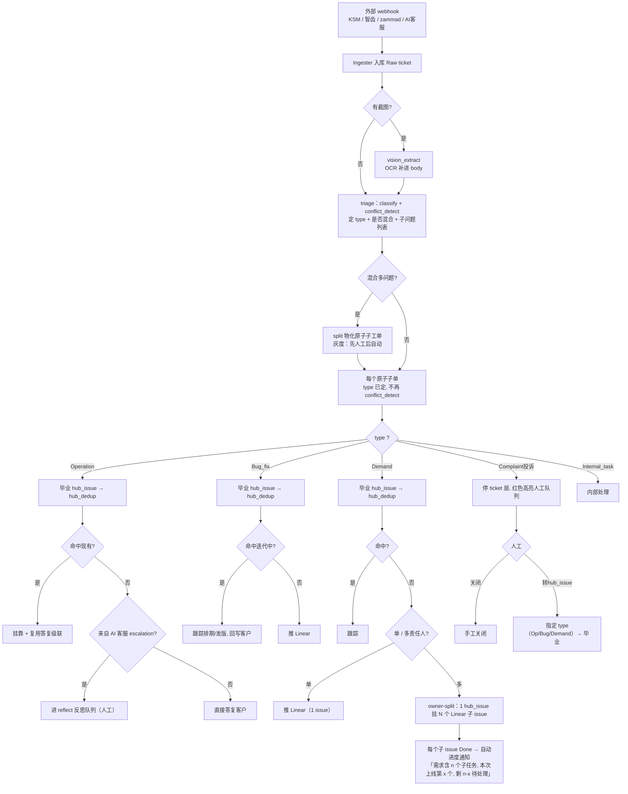
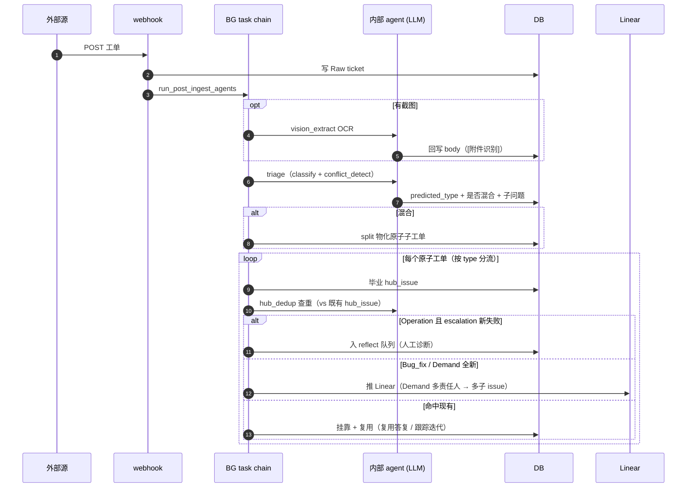
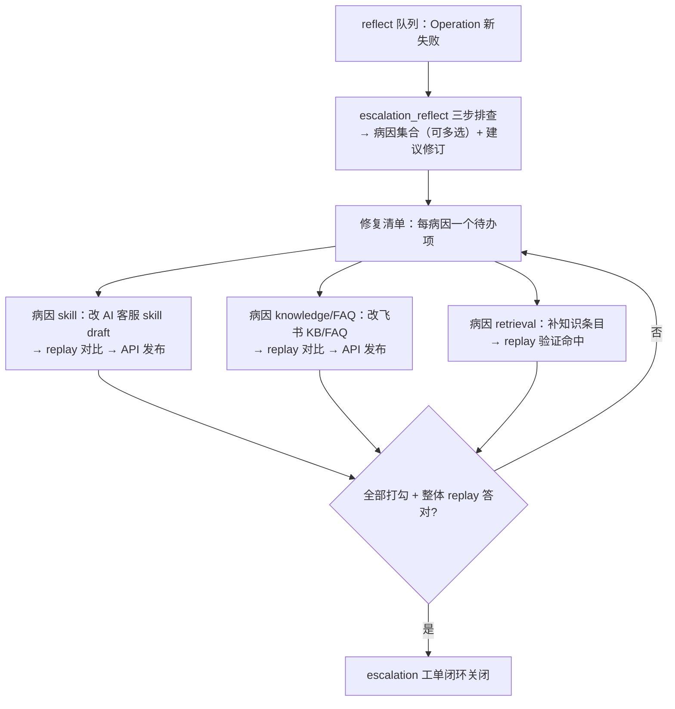

# ADR 0016：Agent 流水线重构 — 分诊→原子化→按类型分流

- 状态：**已采纳（Accepted）**（决策全部锁定，2026-07-05）
- 日期：2026-07-05
- 相关：[[0014-agent-decisions-minimal-audit]]、[[0015-json-vectors-over-pgvector]]、d4-stage3-design、console-redesign

## 1. 背景与问题

当前所有类型的工单走**同一根线性管子**（`run_post_ingest_agents`）：

```
vision → classify → 毕业hub_issue → dedup → conflict_detect → split
```

三个结构性毛病：

1. **dedup 排在 split 前面**。混合工单（「登录失败(bug)+补开发票(operation)」）还没被拆成原子问题，就拿去跟单一问题的 hub_issue 查重——查重语义错乱。这也是 **dedup/split 提案互斥只做了一半**的根因：执行合并后再执行拆分不被挡，会产生「已判重复的工单又被拆」的矛盾态。
2. **类型定义两处维护**。`classify` 和 `escalation_classify` 各存一份四类型文案，改一处另一处不同步，两条链分类口径会悄悄分叉。
3. **skill 版本双轨制**。`classify_v1/classify_v2` 用两个 skill 名 + config 选版，与 `skill_prompts` 表自带的版本历史+回滚**重复实现了版本概念**；列表越攒越长且分不清哪个生效。

同时，业务侧有四个未落地的诉求：Operation 的反思闭环只有 `skill` 病因有落点；Demand 跨多责任人无法在「一个需求」下协作跟踪；投诉类被自动化消化而非第一时间给人；运营/管理员权限未分层。

## 2. 决策

采用 **类型优先 + 先原子化 + 按类型分流** 的流水线，并附带三项横切决策（版本三槽、权限双层、投诉人工分诊）。

### 2.1 核心原则

- **split（原子化）挪到 dedup 之前**：混合工单先拆成「一个问题一张原子子单」，每个原子单再各自 `classify → 毕业hub_issue → hub_dedup`。原子单天生不含多问题 → **永不再拆**（自然满足「子单只拆一次」），且 dedup 只见原子单 → **互斥矛盾从数据流上消失**，不再需要重量级守卫。
- **triage 合并**：`classify + conflict_detect` 合成一次 LLM（「定类型 + 是否混合 + 子问题列表」），省一次调用，避免两处类型定义分叉。
- **hub_dedup 是唯一主查重**：所有类型毕业 hub_issue 时对既有 hub_issue 查重；命中则挂靠复用。ticket 级 `dedup.py`（跨源、咨询性）降级或退役（见 §6）。

### 2.2 五类型分流终局

| 类型 | 路径 |
|---|---|
| **Operation** | 毕业 hub_issue → hub_dedup → 命中?复用答复级联 : （**仅来自 AI 客服 escalation 的新失败**）进 reflect 反思队列；来自 KSM/智齿的新 Operation → 直接答复 |
| **Bug_fix** | 毕业 hub_issue → hub_dedup → 命中迭代中?跟踪排期/发版 : 推 Linear |
| **Demand** | 毕业 hub_issue → hub_dedup → 命中?跟踪 : 定责任人 → 单责任人?推 1 个 Linear issue : **owner-split**（1 hub_issue 挂 N 个 Linear 子 issue） |
| **Complaint（投诉，新增第 5 型）** | 停在 ticket 层，红色高亮人工队列，**不自动毕业**；人工二选一：手工关闭 / 转 hub_issue 并指定 type（Op/Bug/Demand，复用现成 `create-hub-issue` 的 type 覆盖） |
| **Internal_task** | 内部处理 |

### 2.3 skill 三槽版本（替代 _v1/_v2 双轨）

内部 skill_prompts 表改为**每个 skill 名固定三槽**，与外部 AI 客服 `skill-management.json` 的 draft→published→superseded **同构**：

- `previous`（上一版，回滚用）
- `current`（在用版，live）
- `draft`（准备迭代版，验证中，不生效）

agent 统一 `load_prompt("classify")`，版本完全走三槽；废弃 `classify_v1/v2` 命名。**内外一套版本语义**。

### 2.4 权限双层

| 角色 | 能改 |
|---|---|
| 运营/操作人员（知识运营） | 仅 AI 客服对客 skill（反思工作台）+ 飞书 KB/FAQ |
| 管理员（流程编排） | classify / conflict_detect / dedup / hub_dedup / vision / escalation_classify / reflect + 人员分工 + 流程配置 |

`/admin/skills`（内部编排 skill）保持 `require_admin`；反思工作台 + KB 编辑对知识运营角色放行，且够不到内部 skill。

## 3. 流程图（入库主链）



## 4. 时序图（入库 → agent → 分支）



## 5. 反思闭环（Operation 病因诊断，人工触发，独立于入库链）

多病因**集合**（非单选）+ 修复清单，每病因一项，各自修各自验证，全绿才闭环：



## 6. 后果与取舍

**正面**
- 互斥矛盾从架构消失（split 上游 + 原子单不可再拆），删掉半成品守卫。
- 类型定义单点、版本单轨，运营心智统一。
- 五类型各有明确终局，Operation 反思三病因都有落点。

**代价 / 待决**
- **发版通知 = 每个子 issue Done 即自动发进度通知**（已定）：文案带运行计数「您的需求含 n 个子任务，本次上线第 x 个，剩余 n-x 待处理」，x=n 时即全部完成。**永不等齐 → 无「差一个小功能卡住」；进度框架 → 不碎片化**（客户看到的是一个需求在推进，不是零散功能）。自动发只入 `sync_outbox`，真正对客发送受 KSM `dry_run` 灰度阀保护。
- **triage 合并**（已定）耦合 classify 与 conflict_detect 到一个 prompt；换来省一次 LLM + 类型定义单点。若日后要独立调其一，再拆回两 prompt。
- **ticket 级 dedup 退役删除**（已定）：hub_dedup 成为唯一主查重。**注意级联**——`hub_dedup.py` 目前 `from ...dedup import cosine_similarity`，故删 `dedup.py` 前须先把 `cosine_similarity` 挪到共享位（如 `core/llm_router/embeddings.py` 或新 `core/vecmath.py`）。删除清单：`dedup.py` + `dedup_execute.py` + supervisor 三端点（dedup-proposals/execute-dedup/dismiss-dedup）+ 工作台「重复工单提案」卡 + `ticket_embeddings` 表 + `DEDUP_*` 配置。**保留**：`EmbeddingClient`、`hub_issues.embedding`（hub_dedup 自用自己的列，不碰 ticket_embeddings）。
- **owner-split 复杂度**：新增 `hub_issue_linear_issues` 子 issue 跟踪表 + 研发协同页里程碑 UI + 状态同步扩成一组。
- **灰度顺序**：split 自动化、hub_issue 自动毕业、Linear 推送、发版自动通知 均沿用既有「先审计/人工 → 后自动」剧本，逐项开关。

## 7. 迁移影响

| 改动 | 文件/表 | 迁移 |
|---|---|---|
| 链路重排（split 前置、triage 合并、按类型分流） | `app/api/webhooks.py run_post_ingest_agents`、新 `services/agents/triage.py` | 无（逻辑重排） |
| classify 加第 5 型 Complaint | `prompts/classify_*`、triage prompt | 无（predicted_type 无 CHECK） |
| 投诉分诊：关闭 / 转 typed hub_issue | 复用 `create-hub-issue`（已支持 type 覆盖）+ 工作台投诉队列 | 无 |
| skill 三槽版本 | `skill_prompts` 表 + `prompt_store.load_prompt`、6 个 agent 去 `_vN` | **有**：三槽结构 + 归一 classify_v2→current |
| 类型定义共享 | 抽 `type_taxonomy` 片段，classify/escalation_classify 拼接 | 无 |
| 多病因修复清单 | `reflect` 结果改集合 + escalation 工单挂 checklist | 视存储方式，或 JSON 无迁移 |
| owner-split | 新 `hub_issue_linear_issues(hub_issue_id, linear_uuid, identifier, status, released_at)` + Linear 子 issue API + **每子 issue Done 自动进度通知** | **有** |
| **ticket 级 dedup 退役** | 挪 `cosine_similarity` → 共享；删 `dedup.py`/`dedup_execute.py` + 3 端点 + 工作台重复卡 + `DEDUP_*` 配置 + 掉 `ticket_embeddings` 表 | **有**（drop 表） |
| 权限双层 | 知识运营角色能力 vs `require_admin` | 无（能力对齐） |

## 8. 落地分期（建议）

1. **P0 补洞**：reflect prompt 入库、Skill 配置页「内部 vs 对客」认知澄清、reflect 队列加 Operation-only 过滤。
2. **P1 版本三槽**：内外统一 draft/current/previous，废 _v1/_v2。
3. **P2 链路重排**：triage 合并 + split 前置 + 五类型分流 + Complaint 第 5 型 + 类型定义共享（本 ADR 地基，充分单测）。
4. **P3 反思闭环补全**：多病因修复清单 + KB/FAQ 调试（依赖飞书 KB/FAQ API）。
5. **P4 owner-split**：子 issue 跟踪 + 核心/可选 + 自动里程碑通知。
6. **P5 权限双层**落地。
