# 业务状态机与流程图（实际实现，非设计意图）

> **口径**：本文所有状态取值、迁移边、判定条件都是 2026-09-09 从 `feat/unified-state-and-embedded-ticket` 分支代码里逐个 grep 出来的**实际行为**，包括历史遗留的死值和越界写。与操作手册 / 早期 spec 冲突时**以本文为准**（冲突点已标注）。
>
> **用途**：ADR-0017 D1 的收口依据。方案 B（27 处 `hub.status =` 裸写收口到 `apply_hub_status`、旧字段降级为 stage 派生视图）动手前，先在这里对齐「到底有哪些状态、谁在写、写成什么」。
>
> **维护规则**：引用一律用 `文件.函数`，**不写行号**（行号必然漂移）。改了任何状态写入点，同步改本文对应的边。

---

## 0. 全景：一条工单的三层状态

一条工单同时活在三层，每层一套状态字段；ADR-0017 的 `stage` 是把三层折成一个的派生量。

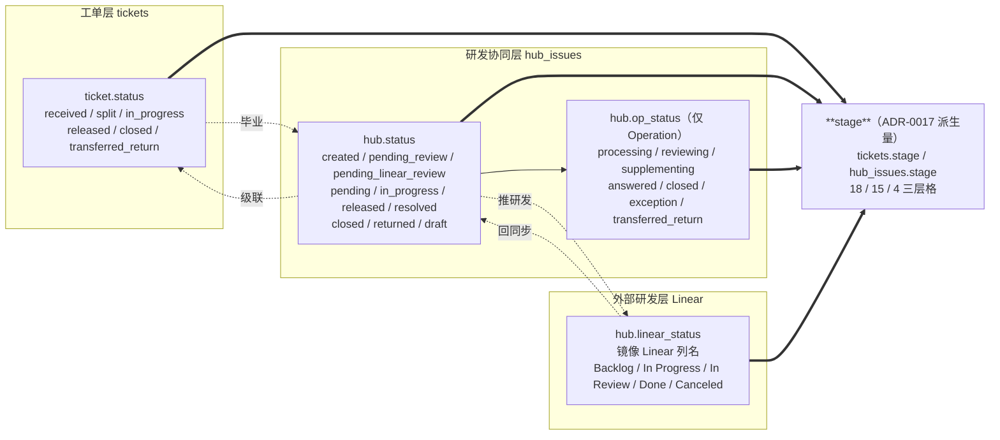

**关键点**：`stage` 是**只读派生量**，由 `before_flush` 监听器从上面 4 个字段算出，业务代码永远不直接写它。包含关系 `TICKET_STAGES ⊇ HUB_STAGES ⊇ LINEAR_STAGES`。

---

## 1. 统一主状态 `stage`（ADR-0017 D1）

18 个值，定义在 `services/state/stage.py`。这是**对外唯一口径**：API 的 `stage/stage_label`、前端展示、列表筛选、门户统计全用它。

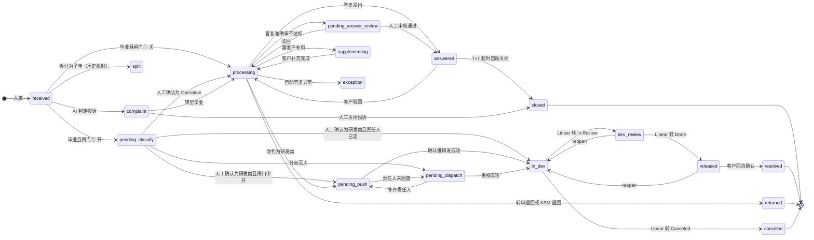

**分组语义**（`stage.py` 常量，供队列与统计复用）：

| 集合 | 成员 | 用途 |
|---|---|---|
| `TERMINAL_STAGES` | resolved / closed / returned / canceled | 「已完结」统计口径 |
| `WAITING_HUMAN_STAGES` | complaint / pending_classify / pending_dispatch / pending_answer_review / pending_push / exception | 工作台「需人工介入」队列 |
| `LINEAR_STAGES` | in_dev / dev_review / released / canceled | 研发层子集 |

---

## 2. `ticket.status` 实际状态机 ⚠️ 含死值

**全文最重要的一张图**：实际写入点只有 6 处，`linked / waiting_reply / replied` 三个值**从来没有任何代码写过**。

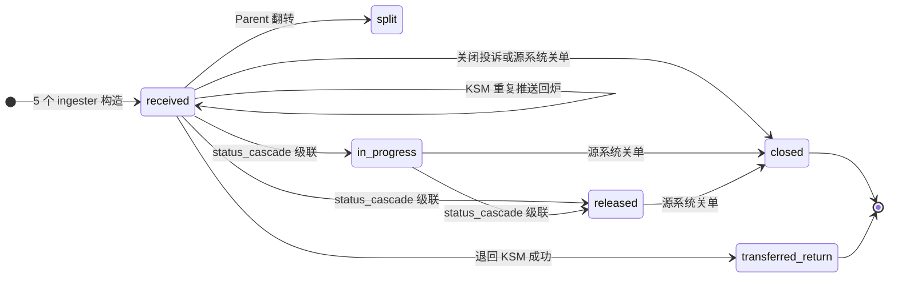

**实际写入点全集**（只有这 6 处）：

| 目标值 | 写入点 | 触发 |
|---|---|---|
| `received` | 5 个 ingester 构造 + `ksm_ingester.ingest`（重复推送分支） | 入库 / KSM 重复推送回炉 |
| `split` | `agents/split.execute_split_for_ticket` | Parent 翻转（旧 Child 拆分机制，已被 Hub 子任务取代） |
| `in_progress` `released` | `cascade/status_cascade.apply_hub_status` | **唯一**入口，白名单 `_TICKET_CASCADE_STATUSES` 级联 |
| `closed` | `supervisor.close_complaint_endpoint`、`ksm/writeback._close_local`、`zhichi/writeback._close_local` | 关闭投诉 / KSM 关单 / 智齿关单 |
| `transferred_return` | `ksm/writeback._close_ticket_returned` | 退回 KSM 成功 |

**死值 / 只读值**：

| 值 | 状况 | 影响 |
|---|---|---|
| `linked` `waiting_reply` `replied` | ❌ **零写入点** | 操作手册 §5「状态含义速查」描述的 `received → linked → waiting_reply → in_progress → replied → done` 流程**不存在**，手册这一段是错的 |
| `done` `rejected` `superseded` | 只被**读**（`_TICKET_TERMINAL_STATUSES`、`metrics/workbench`、`ksm/writeback` 终态白名单） | 可能有历史数据；新代码不产生 |

> **收口建议（B1）**：`ticket.status` 实际只有 6 个活值，可直接收敛为 `received / split / in_progress / released / closed / transferred_return`，死值下一次迁移清理。

---

## 3. `hub.status` 实际状态机 ⚠️ 含越界值

27 处裸赋值，只有 1 处走 `apply_hub_status` 单一入口（`linear_status_sync`）。这是 Phase 1b 的主战场。

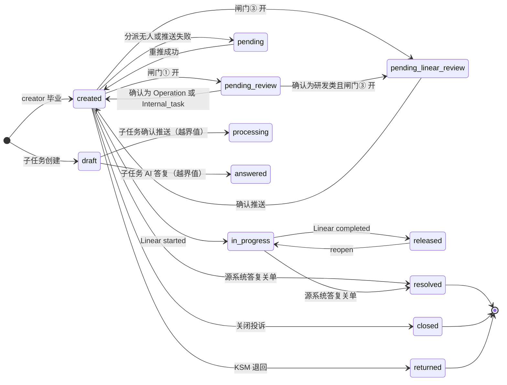

**写入点分布**（27 处裸写）：

| 文件 | 处数 | 典型函数 |
|---|---|---|
| `api/supervisor` | 10 | `confirm_classification` / `reclassify` / `dismiss_classification` / `confirm_linear_push` |
| `api/hub_issues` | 7 | `update_attributes` / `confirm_subtask_endpoint` |
| `services/hub_issues/creator` | 3 | `_mark_pending_review` / `_mark_pending_linear_review` / `_mark_dispatch_pending` |
| `services/hub_issues/linear_push` | 3 | `_mark_pending` / `_push_via_webhook` / `push_hub_issue_to_linear` |
| `services/ksm/writeback` + `zhichi/writeback` | 4 | `_close_local` / `_close_ticket_returned` |
| `cascade/status_cascade` | 1 ✅ | `apply_hub_status`（唯一合规入口） |

**⚠️ 越界值**：子任务确认接口把 **Operation 的 `op_status` 值写进了 `hub.status`**：

| 越界值 | 写入点 | 问题 |
|---|---|---|
| `answered` | `api/hub_issues.confirm_subtask_endpoint` | 与 `op_status='answered'` 语义重复、双写 |
| `processing` | `api/hub_issues.confirm_subtask_endpoint`（2 处） | 同上 |

**好消息**：三处越界写全在**同一个函数**里，B2 是单点改动。

`stage.py` 的 `_HUB_STATUS_DIRECT` 映射表**刻意兜住了这两个值**（照直译成对应 stage），所以展示层不受影响——但这是打补丁，B2 应把它们改回 `apply_op_status`。

**`draft`**：子任务专用状态（`tickets.create_ticket_subtask`、`webhooks._populate_subtasks_from_triage` 写入），不在任何 CHECK 里（`hub_issues.status` 是无约束 String(32)），`supervisor/manual_assign` 靠它筛「草稿态子任务」。

---

## 4. `op_status` 状态机（Operation 运营机）

唯一入口 `apply_op_status`（`services/hub_issues/op_status.py`），13 个调用点，收敛得最好——**这是方案 B 的样板**。

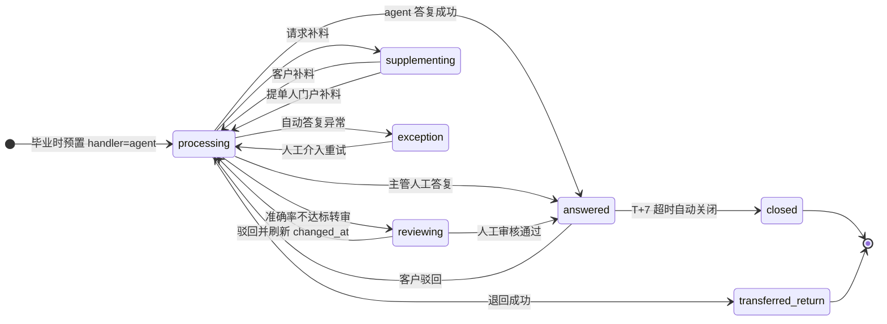

**调用点**：`operation_answer`（agent 链 4 处）/ `hub_issues` + `tickets`（人工答复）/ `supervisor`（改判回炉 2 处）/ `ksm_ingester` + `zhichi_ingester`（客户驳回、源系统终态 4 处）/ `supply_sync`（补料）/ `ksm/writeback`（退回）/ `op_status.close_overdue_answered`（T+7）/ `portal`（提单人补料 🆕）。

**三条不要「顺手优化」掉的设计**：

- `apply_op_status` **只维护状态**，映射驱动的底层动作（`answered → author_reply`、`closed → 关单回写`）刻意留给调用方。
- `close_overdue_answered` 只动 `op_status`，**不动 `hub.status` / `ticket.status`**——T+7 是纯超时关闭，没有外部事件驱动关单回写。
- 驳回会刷新 `op_status_changed_at`，天然不会被 T+7 扫描重复扫到；幂等：状态与 handler 都没变则 no-op 不写历史。

---

## 5. Linear 回同步映射

`linear_status_sync` 每 5 分钟轮询，是**唯一**走 `apply_hub_status` 的调用点。

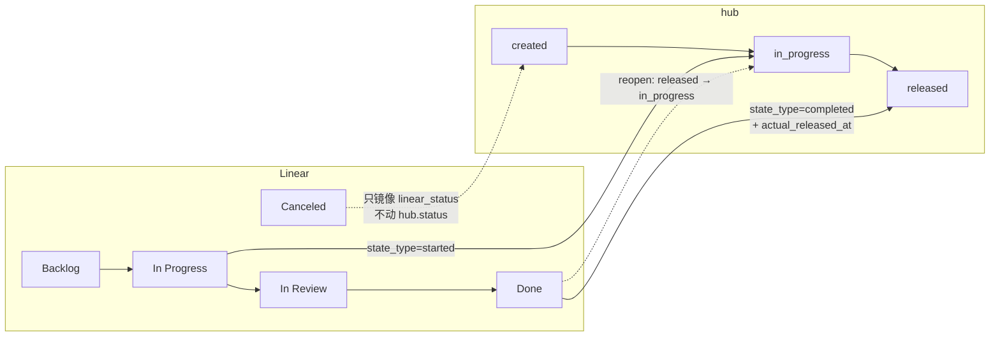

**双层回写**：

- `linear_status` 始终**镜像 Linear 原始列名**（展示层，可以是任意自定义列）。
- `hub.status` 只做**保守级联**：`started → in_progress`、`completed → released`。
- `canceled` **只镜像不动状态**——研发取消需要主管判断，不能自动关掉客户工单。
- reopen 跟随（`released → in_progress`），Linear 是研发态的源头。
- Linear 侧删除的 issue 只计数不动数据。

---

## 6. 入库主链流程（含三道闸门）

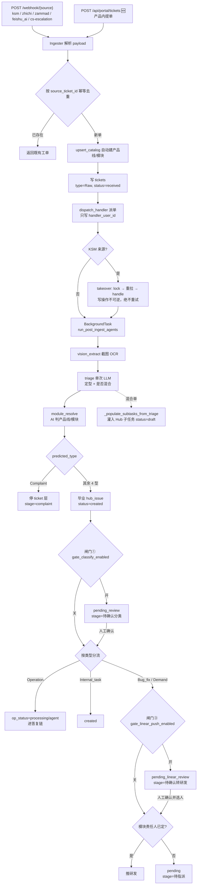

**闸门开关**：

| 闸门 | 配置项 | 默认 | 停在哪 |
|---|---|---|---|
| ① 分类确认 | `gate_classify_enabled`（None 回落 `require_review_before_linear`） | True | `pending_review` |
| ② 答复确认 | `operation_answer_accuracy_mode`（`off/observe/enforce/review`） | `off` | `reviewing` |
| ③ 推研发确认 | `gate_linear_push_enabled` | True | `pending_linear_review` |

> **顺序坑**：派单在 **triage 之前**执行，所以派单规则的「适配产品线/模块」两个维度已停用（那时还没判出模块），只按来源 + SLA 匹配。

---

## 7. Operation 自动答复链（闸门②）

Celery beat 每 2 分钟 drain，**不在 ingest 热路径上**（replay 慢约 138s/单会阻塞 worker）。

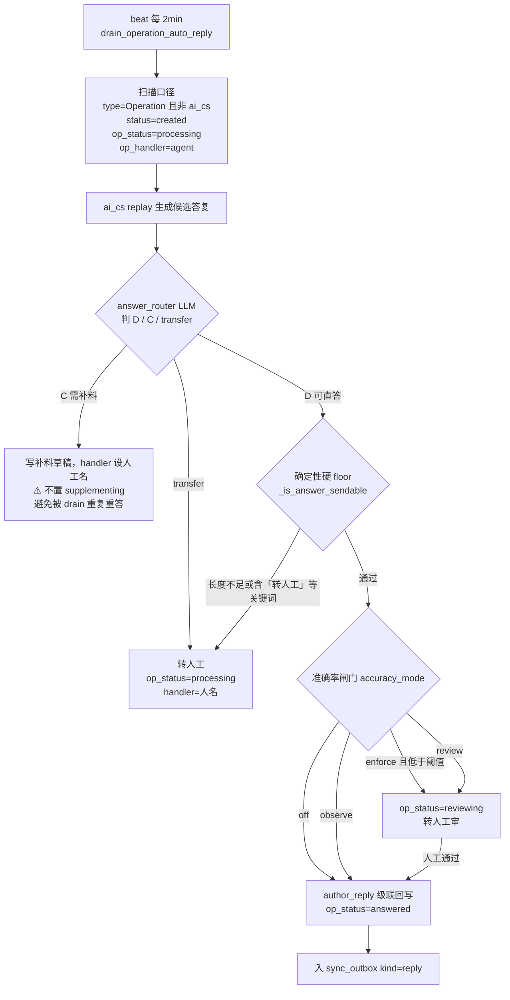

**三处不能动的设计**：

- `cited_knowledge` / `skills_used` **必须当场存**（D 和 D_review 两条路径都存）——反思诊断要还原黄金三元组，晚存就永久丢了。
- 打分器异常或非法 JSON **一律兜底 `accuracy=0`**（安全侧）。
- 只对 `AiCsNetworkError` 重试 3 次；业务错直接抛并落 `exception`，不无限重扫。

---

## 8. 转研发出口（飞书 webhook 默认 / Linear 直连备选）

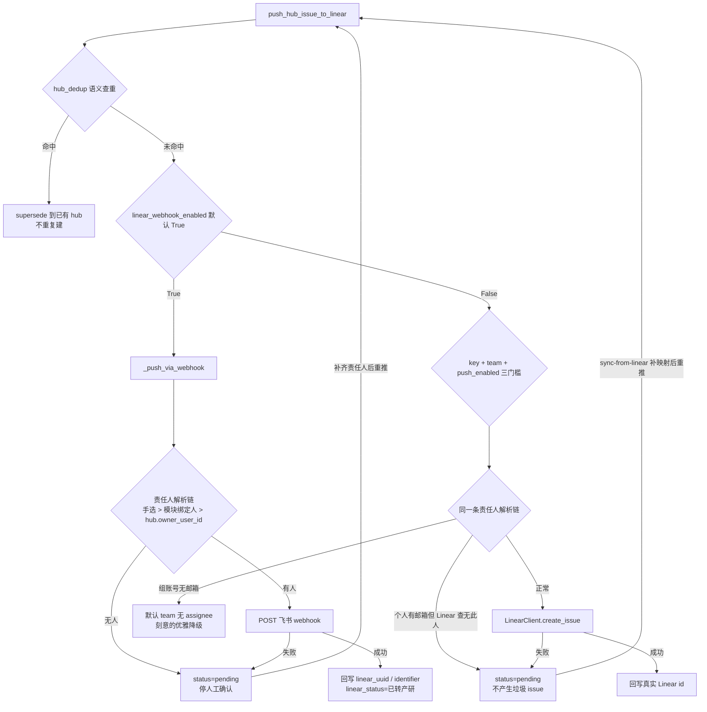

**两个坑**：

- **字段口径**：`ticketNo` 用**来源系统**的 `source_ticket_number`（KSM billNumber），不是本系统 short_code；`handleUser` 用模块研发责任人，查不到才回落 hub 责任人。
- **假 UUID**：webhook 分支若解析不到真实 Linear id，**不能把占位值写进 `linear_uuid`**（该字段被 `linear_status_sync` 轮询消费，假 UUID 会让轮询查错对象），改用 `linear_identifier` 占位做幂等判断。

---

## 9. 出站回写 `sync_outbox`

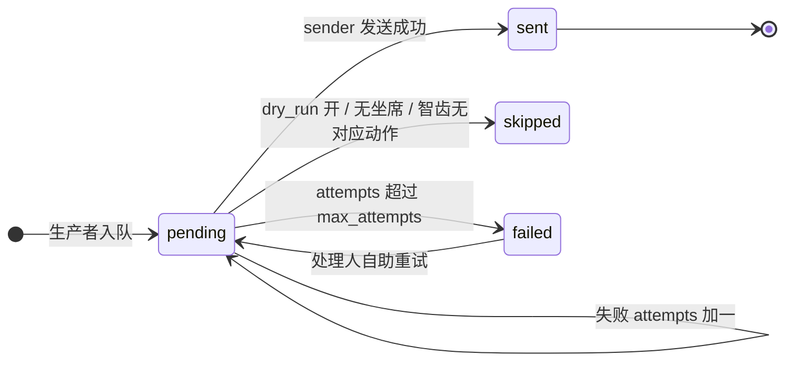

**只有 `pending` 行会被 drain**，成功翻 `sent` 保证幂等；`failed` 行永久卡住，靠 `cascade/outbox_retry` 的自助重试复活（复用 sender 内部 `_process_row`，不重新实现发送）。

**kind → 源系统动作映射**：

| kind | 生产者 | KSM 动作 | 智齿 ticket_status |
|---|---|---|---|
| `reply` | reply_sync / 自动答复 | lock → 重拉 → handle(is_deal=True) 答复关单 | `'3'` 已解决关单 |
| `status` | status_cascade | in_progress → lock 接管；released → lock→handle 关单 | in_progress → skip；released → `'3'` |
| `supply` | supply_sync | lock → 重拉 → supplyKsmOrder 补料 | `'2'` 等待回复不关单 |
| `release_note` | owner_split（x=n 最后一个） | handle 关单 | `'3'` |
| `progress_note` | owner_split（x<n） | handle(is_deal=False) 只回复不关单 | `'2'` |
| `return` | return_sync | returnKsmOrder 退回不关单 | 不适用 |

**KSM 时序铁律**：必须 `lock → 经 NoticeStore 重拉 subscribeCallback 刷新 node → handle/supply`。lock 后 node.id 会流转，不重拉直接 handle 会报「已流转至其他节点」。

---

## 10. 附件流水线

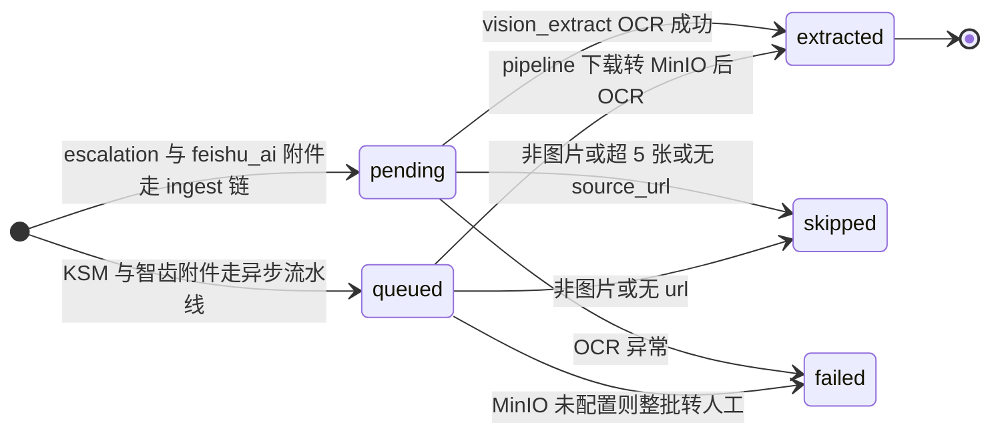

`pending`（ingest 链同步）与 `queued`（beat 每 5min 异步 drain）是**两条独立通道**，别混。MinIO 未配置时整批标 `failed` 转人工，**绝不静默成功**。

---

## 11. KSM 接管（takeover）

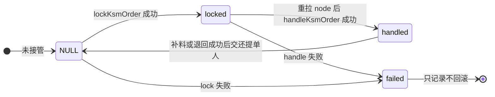

**是否 handle 看本系统是否已有该单**：新单完整受理，已存在的只 lock 不 handle。**写操作绝不自动重试**——超时可能已成功，重试会重复接管；失败只记 `ksm_takeover_status='failed'`，KSM 写操作无逆操作接口，无法回滚。

---

## 12. 产品内提单门户（ADR-0017 D4）🆕

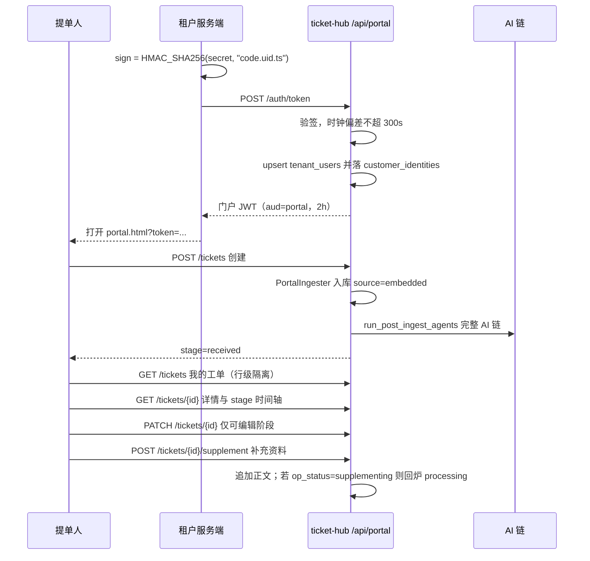

**提单人视角的 stage 收敛**（`frontend/src/portal/stage.ts`）：18 个后端 stage 折成 3 组 + 4 步里程碑。

| 分组 | 成员 stage | 语义 |
|---|---|---|
| 待我补充 | supplementing | 需要提单人行动 |
| 已完结 | resolved / closed / returned / canceled | 终态 |
| 处理中 | 其余全部 | 对提单人是同一件事：在处理 |

| 里程碑 | 对应 stage |
|---|---|
| 已接收 | received / complaint / pending_classify |
| 处理中 | 其余中间态 |
| 已答复或已发版 | answered / released |
| 已完结 | 终态 4 个 |

**可编辑窗口**：只在 `received / pending_classify / supplementing` 三个 stage 允许 PATCH 标题正文，其余阶段返回 409 并引导走「补充资料」。**无删除接口**（提单人 C/R/U 无 D）。

---

## 13. 旧字段 → `stage` 映射矩阵（Phase 1b 收口依据）

派生优先级（`derive_hub_stage` / `derive_ticket_stage`，从上到下短路）：

| # | 条件 | → stage |
|---|---|---|
| 1 | `ticket.status='transferred_return'` 或 `hub.status='returned'` 或 `op_status='transferred_return'` | `returned` |
| 2 | `ticket.status='split'` 或 `ticket.type='Parent'` | `split` |
| 3 | 无 hub 且 `predicted_type='Complaint'` | `complaint`（终态则直译） |
| 4 | 无 hub 且 `ticket.status` 为终态：`done→resolved`，`closed/rejected/superseded→closed` | 直译 |
| 5 | 无 hub 其余 | `received` |
| 6 | `hub.status`：`pending_review→pending_classify`，`pending_linear_review→pending_push`，`pending→pending_dispatch` | 闸门态 |
| 7 | `op_status` 非空，7 个值一一映射 | 运营机态 |
| 8 | `hub.status ∈ {resolved, closed, returned, answered⚠️, processing⚠️}` | 直译（⚠️ 兜越界值） |
| 9 | 研发类：canceled 优先 > released > Linear 细粒度 > `in_progress→in_dev` > `processing` | 研发态 |
| 10 | 其余：`released→released`，否则 `processing` | 兜底 |

**为什么闸门（6）优先于运营机（7）**：毕业时 `op_status` 已预置 `processing`，但闸门① 开时工单卡在 `pending_review` 等人确认分类，这时不该显示运营机的「处理中」。

**为什么运营机（7）优先于 hub 终态（8）**：答复回写成功会立即把 `hub.status` 推到 `resolved`，但 `op_status` 独立停在 `answered` 观察期——T+7 自动关闭前不该被误显示成「已关闭」。

---

## 14. 收口路线图（方案 B）

按风险从低到高：

| 步骤 | 动作 | 风险 | 影响面 |
|---|---|---|---|
| B1 | 清理 `ticket.status` 三个死值，修正操作手册 §5 | 低 | 无写入点，纯文档 + 枚举 |
| B2 | `confirm_subtask_endpoint` 的 `answered/processing` 改回 `apply_op_status` | 低 | 单函数 3 处 |
| B3 | 27 处 `hub.status =` 分批收口到 `apply_hub_status`，按文件：`creator`(3) → `linear_push`(3) → `writeback`(4) → `hub_issues`(4) → `supervisor`(10) | 中 | 级联语义要逐处确认 |
| B4 | `apply_hub_status` 增加合法迁移校验（当前无校验，任意值都能写进去） | 中 | 可能挡住历史脏路径 |
| B5 | 旧 4 字段降级为 `stage` 的派生视图，反向由 `apply_stage()` 单入口驱动 | 高 | 改写全部读取点 |

每步之间跑 `backend/scripts/reconcile_stage.py` 确认 0 drift。

**为什么 B3 排在 B4 前**：先把写入点收敛到一个函数，再在那个函数里加校验；反过来会让 27 处裸写各自撞校验。

**样板参考**：`op_status` 已经是「唯一入口 + 13 调用点」的形态（§4），`hub.status` 照它做即可。
